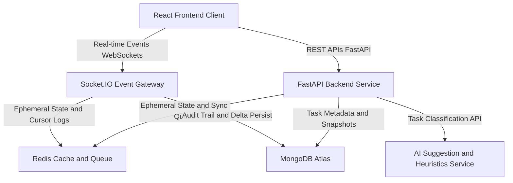

# PulseTasks — Realtime Collaborative Task Management Platform

PulseTasks is a production-grade, real-time collaborative task management platform targeted at asynchronous knowledge teams and SMEs. It merges conflict-free document editing, real-time presence indicators, and local/cloud-hybrid AI triage into a single unified engine.

---

### **Business Problem Statement**
> **Modern collaborative task systems suffer from three core operational issues: (1) Collaborative Drift—asynchronous team members spend hours in meetings clarifying vague requirements; (2) Connectivity Fragility—optimistic lock-based synchronizations fail or silently drop edits under unreliable networks, causing data loss; and (3) Team Workload Burnout—tasks are assigned blindly without taking calendar availability or team load into account. PulseTasks solves these problems by combining conflict-free offline editing (CRDTs), real-time presence indicators, automated AI-powered task refactoring into actionable subtasks, and load-aware prioritization into a single, cohesive engine.**

---

## 1. System Architecture & Data Flow

PulseTasks is built on a split REST / WebSocket hybrid architecture to separate transactional resource management from high-frequency real-time synchronization.



### Architectural Rationale
- **FastAPI (ASGI)**: Handles asynchronous request concurrency with minimal memory overhead, utilizing Python's `asyncio` event loops.
- **Redis**: Used as an in-memory key-value cache with TTL expiration rules to store ephemeral user presence, typing indicator signals, cursor positions, and offline operation sync queues.
- **MongoDB**: Serves as the primary document store for transactional persistence (users, lists, tasks) and historical snapshotting of CRDT states.
- **Yjs / ypy**: Replaced traditional optimistic locking with conflict-free replicated data types (CRDTs) to allow deterministic merge resolution across multiple network nodes.

---

## 2. Core Technical Specifications

### A. CRDT & Offline Sync Engine
- **Binary Deltas**: User edits are recorded as binary CRDT operation deltas.
- **Causal Replay**: Offline operations buffer locally and replay sequentially on reconnect via `/api/v1/offline/queue`.
- **Lock-Free Snapshots**: States persist to MongoDB via transactional snapshots, avoiding database locks.

### B. Redis Presence & Cursor Engine
- **Presence TTL**: User status keys (`presence:{workspace_id}:{user_id}`) expire automatically in Redis via a 300-second TTL.
- **Purge Routines**: Background workers prune defunct sessions if periodic heartbeats fail.
- **Cursor Tracking**: Typing state and cursor coordinates `{line, column}` are cached in Redis and broadcast via WebSockets.

### C. AI Task Refactoring
- **Pipeline**: Matches inputs against templates; high-confidence targets are automatically refactored into checklist items.
- **Performance**: Sub-50ms heuristic processing fallback with optional cloud LLM routing.

---

## 3. Database Schema

The system uses MongoDB as its primary persistence layer. The documents follow these strict Pydantic configurations:

### `users` Collection
Stores credential hashes and account status details.
```json
{
  "_id": "ObjectId",
  "email": "user@example.com",
  "name": "Jane Doe",
  "password_hash": "$2b$12$KjB...",
  "created_at": "ISODate",
  "disabled": false
}
```

### `workspaces` Collection
Defines permission and organizational boundaries.
```json
{
  "_id": "ObjectId",
  "name": "Engineering Team",
  "owner_id": "ObjectId",
  "member_ids": ["ObjectId"],
  "region": "us-east-1",
  "created_at": "ISODate"
}
```

### `lists` Collection
Represents workspace task divisions linked to a Yjs document sync key.
```json
{
  "_id": "ObjectId",
  "workspace_id": "ObjectId",
  "title": "Sprint Backlog",
  "y_doc_key": "c4ca4238a0b923820dcc509a6f75849b",
  "created_at": "ISODate"
}
```

### `tasks` Collection
Houses standard task attributes and priority labels.
```json
{
  "_id": "ObjectId",
  "list_id": "ObjectId",
  "title": "Implement JWT Auth Flow",
  "description": "Create sign-up and login endpoints.",
  "assignee_id": "ObjectId",
  "priority": 3,
  "status": "IN_PROGRESS",
  "due_date": "ISODate",
  "tags": ["backend", "security"],
  "created_at": "ISODate",
  "updated_at": "ISODate"
}
```

### `ai_suggestions` Collection
Collects telemetry and historical feedback loops.
```json
{
  "_id": "ObjectId",
  "task_id": "ObjectId",
  "workspace_id": "ObjectId",
  "rewritten_title": "Implement JWT Access and Refresh Token Flow",
  "checklist": [
    "Configure secure cookie options",
    "Generate refresh token collection schema",
    "Add token expiration validation tests"
  ],
  "priority": 4,
  "due_date": "ISODate",
  "explanation": "Extracted checklist deliverables and increased priority based on security tags.",
  "confidence": 0.92,
  "accepted": true,
  "created_at": "ISODate"
}
```

---

## 4. API & WebSocket Contracts

### REST Endpoints (Representative)

| Method | Endpoint | Description | Auth Required |
| :--- | :--- | :--- | :--- |
| `POST` | `/api/v1/auth/signup` | Registers new user credentials | No |
| `POST` | `/api/v1/auth/login` | Validates credentials, issues JWT access & refresh tokens | No |
| `POST` | `/api/v1/ydocs/` | Creates a new Yjs document list | Yes |
| `GET` | `/api/v1/ydocs/{ydoc_key}` | Retrieves Ydoc list metadata | Yes |
| `POST` | `/api/v1/ydocs/sync/{ydoc_key}` | Syncs new CRDT operations to a document | Yes |
| `POST` | `/api/v1/offline/queue` | Buffers offline operations in Redis | Yes |
| `POST` | `/api/v1/offline/sync/{ydoc_key}` | Applies all buffered offline operations to database | Yes |
| `POST` | `/api/v1/presence` | Updates real-time user status in Redis | Yes |

### Socket.IO Gateway Events

- **`join_workspace`** (Client → Server)
  ```json
  {
    "workspace_id": "ws_123",
    "auth_token": "bearer eyJ..."
  }
  ```
- **`presence_update`** (Server → Client)
  ```json
  {
    "user_id": "user_456",
    "presence": "online",
    "last_seen": "2026-06-21T11:41:01Z"
  }
  ```
- **`ydoc_update`** (Server ↔ Client)
  ```json
  {
    "doc_key": "c4ca4238a...",
    "delta": "Base64EncodedBinaryDeltaData"
  }
  ```

---

## 5. Verification & Test Suite

Quality assurance is verified by a comprehensive automated test suite consisting of **270 tests** (249 unit, 21 integration).

The testing framework is built on **pytest 7.4.4** and **pytest-asyncio** using mock implementations of Redis (ephemeral operations) and Motor MongoDB (coroutine cursors).

### Test Coverage Highlights
- **Integration Tests**: Tests authentication sequences, tokens rotation, and Ydoc updates/presence syncing over mock HTTP clients.
- **Unit Tests**: Asserts that `task_service` status transitions (like `OPEN` -> `IN_PROGRESS`) function forward correctly, rejects backward shifts, and validates password constraints.

### How to Run Tests Locally
1. Navigate to the backend directory:
   ```bash
   cd backend
   ```
2. Activate the virtual environment:
   ```bash
   # Windows PowerShell
   .\.venv\Scripts\Activate.ps1
   # macOS/Linux
   source .venv/bin/activate
   ```
3. Run the test suite:
   ```bash
   pytest tests/ -v
   ```

---

## 6. Local Setup and Deployment Guide

### Prerequisites
- Python 3.12+
- Redis Server (local or cloud-managed)
- MongoDB Server (local or Atlas)

### Setup Steps
1. **Clone the repository and install dependencies**:
   ```bash
   cd backend
   pip install -r requirements.txt
   ```
2. **Configure environment variables**:
   Create a `.env` file from the template:
   ```bash
   cp .env.example .env
   ```
   Provide your values for `MONGODB_URL`, `REDIS_URL`, and `SECRET_KEY`.
3. **Start the development server**:
   ```bash
   uvicorn app.main:app --reload --port 8000
   ```
   The interactive API docs will be available at `http://localhost:8000/docs`.
