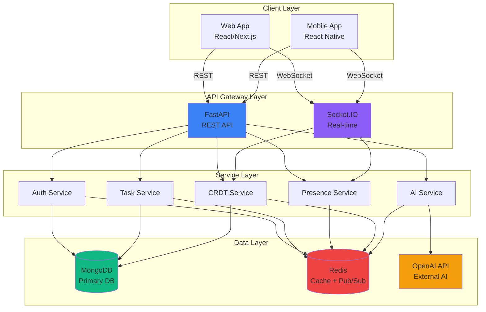
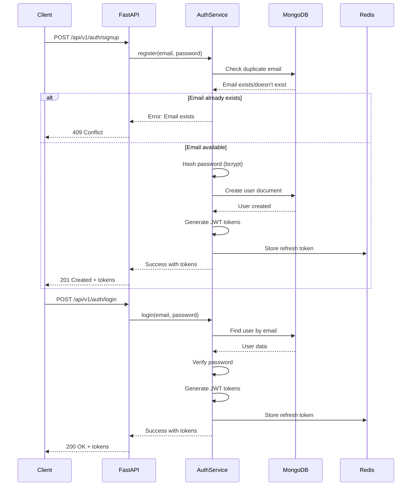
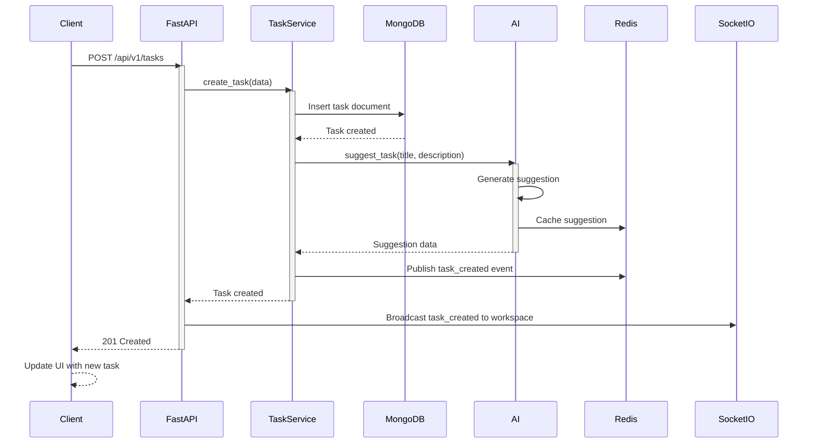
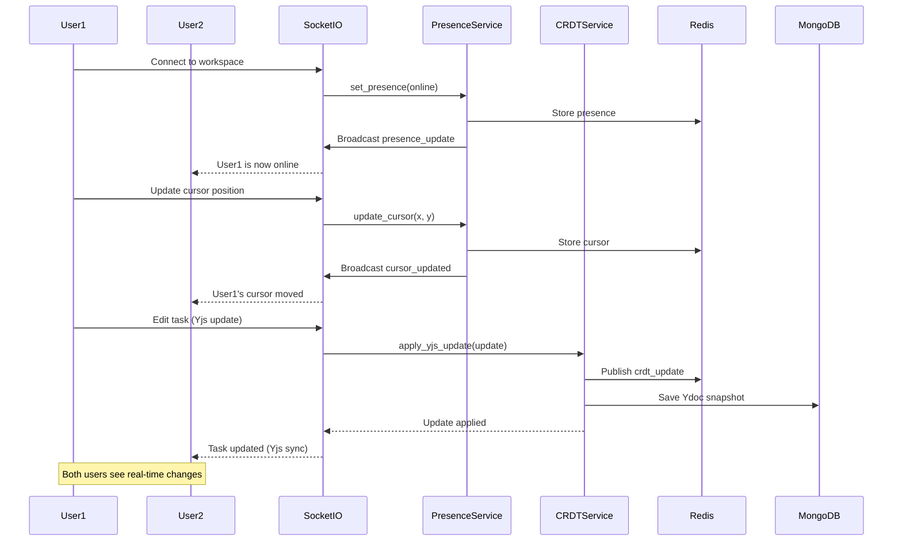
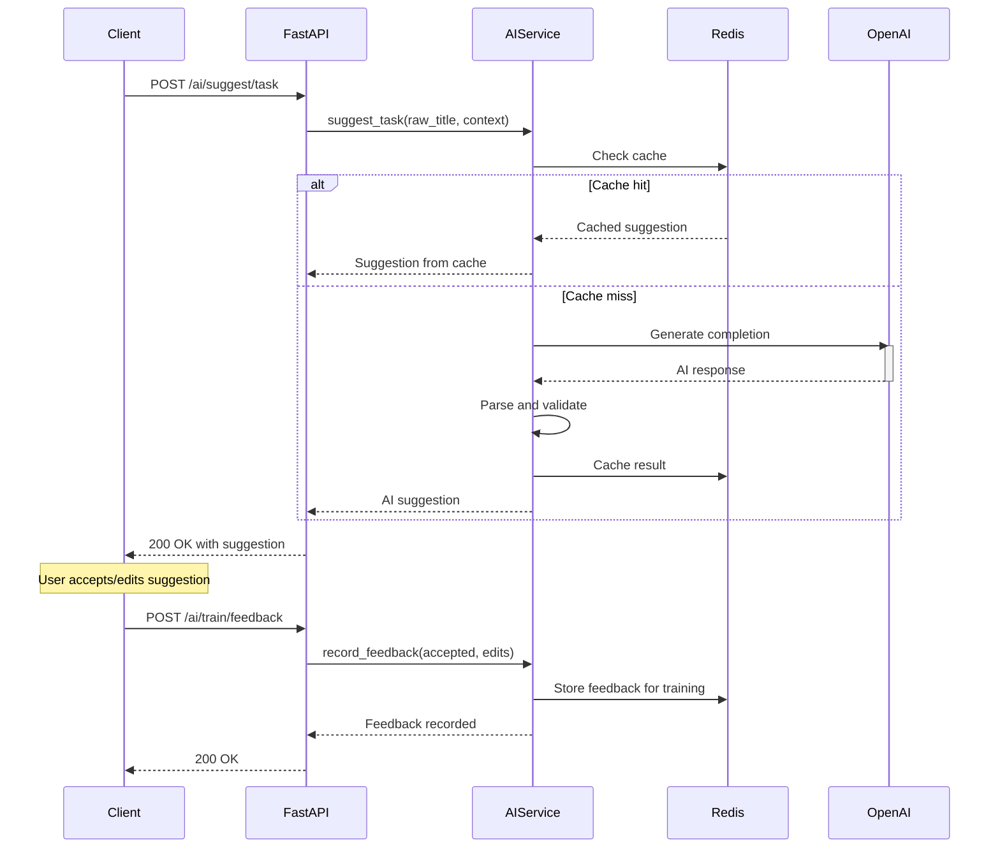
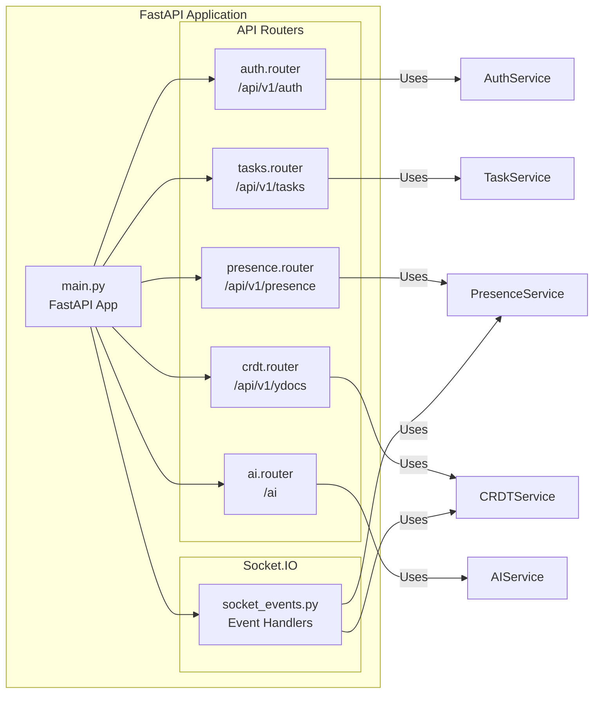
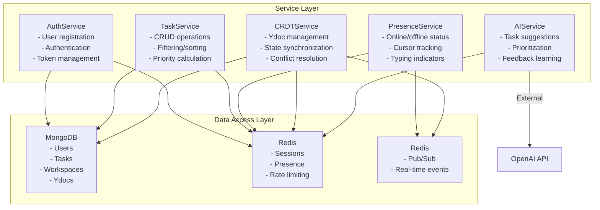
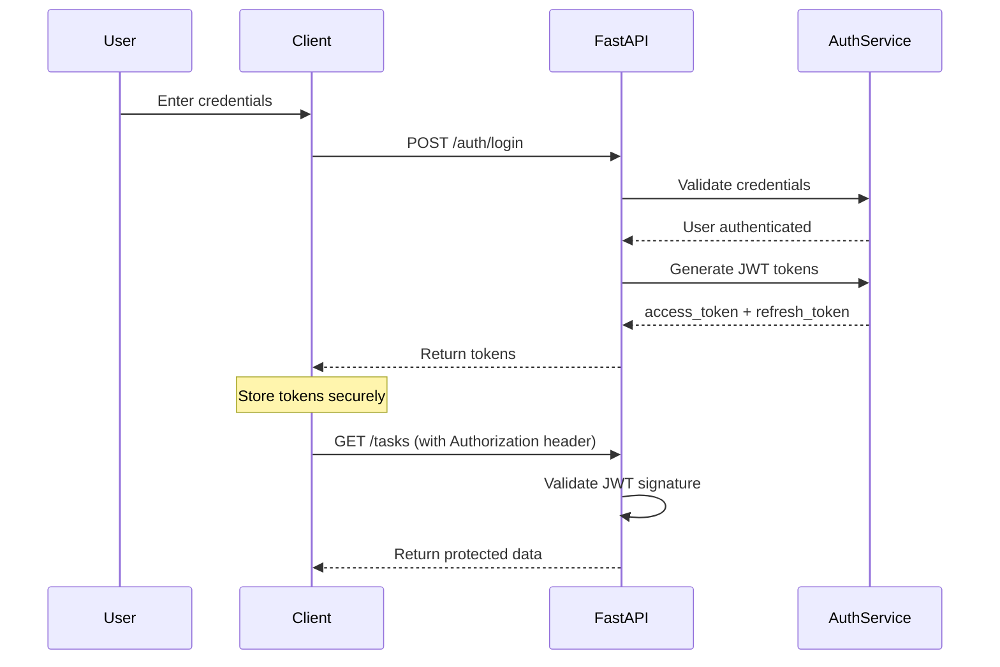
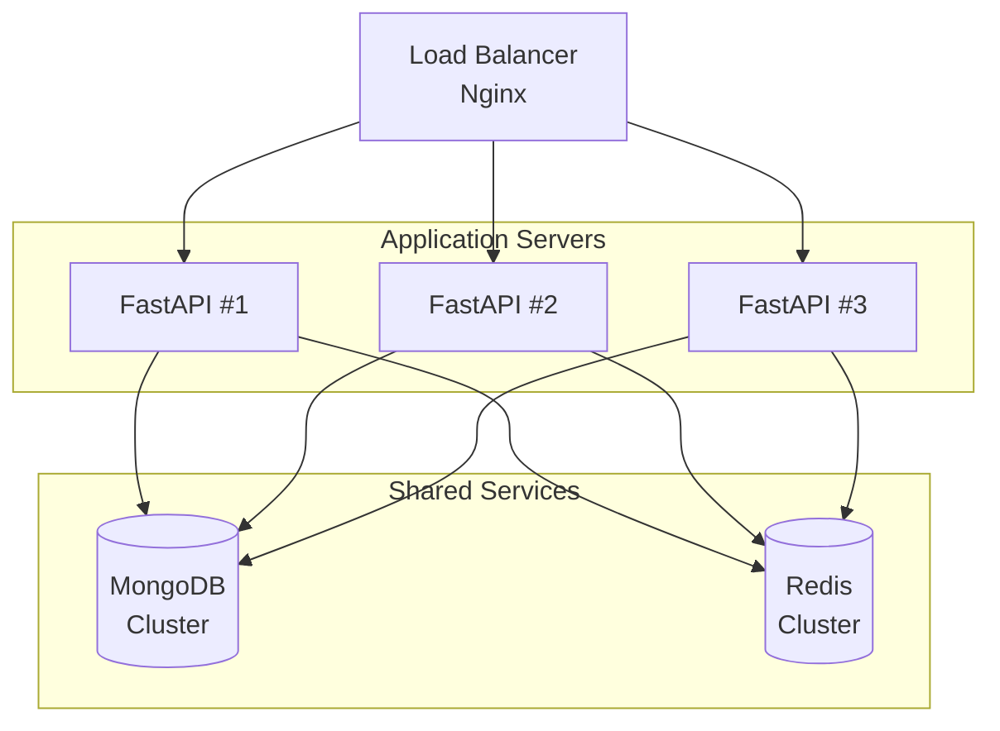

# Architecture Documentation

Complete system architecture, data flows, and component interactions for PulseTasks.

---

## System Overview

PulseTasks is a real-time collaborative task management platform with AI-powered features. The architecture follows a microservices-like pattern with distinct components for authentication, task management, real-time collaboration, and AI suggestions.



---

## Technology Stack

### Backend

| Component | Technology | Version | Purpose |
|-----------|-----------|---------|---------|
| **API Framework** | FastAPI | 0.109.0 | REST API framework |
| **WebSocket** | Python-SocketIO | 5.11.0 | Real-time communication |
| **ASGI Server** | Uvicorn | 0.27.0 | ASGI server |
| **Database** | MongoDB | 7.0 | Primary database |
| **Cache** | Redis | 7-alpine | Caching + Pub/Sub |
| **ORM** | Motor | 3.3.2 | Async MongoDB driver |
| **Authentication** | python-jose | 3.3.0 | JWT tokens |
| **Password Hashing** | Passlib | 1.7.4 | Bcrypt hashing |
| **HTTP Client** | httpx | 0.26.0 | Async HTTP requests |
| **Task Queue** | Celery | 5.3.6 | Background tasks |
| **AI Integration** | OpenAI API | Latest | AI suggestions |

### Frontend (Planned)

| Component | Technology | Purpose |
|-----------|-----------|---------|
| **Framework** | React/Next.js | UI framework |
| **State Management** | Redux/Zustand | State management |
| **Real-time** | Socket.IO Client | Real-time updates |
| **CRDT** | Yjs | Conflict resolution |
| **HTTP Client** | Axios | API requests |

### DevOps

| Component | Technology | Purpose |
|-----------|-----------|---------|
| **Containerization** | Docker | Container management |
| **Orchestration** | Docker Compose | Multi-container setup |
| **Testing** | pytest | Unit/integration tests |
| **Code Quality** | Black, Flake8, mypy | Linting/type checking |
| **Monitoring** | Prometheus | Metrics collection |

---

## Data Flow Diagrams

### Authentication Flow



### Task Creation Flow



### Real-Time Collaboration Flow



### AI Suggestion Flow



---

## Component Interactions

### API Router Structure



### Service Layer Architecture



---

## Key Design Patterns

### 1. Dependency Injection

FastAPI's dependency injection for clean, testable code:

```python
# Example: Service injection
def get_task_service(db: AsyncIOMotorClient = Depends(get_database),
                    redis: Redis = Depends(get_redis)) -> TaskService:
    return TaskService(db.pulsetasks, redis)

@app.get("/api/v1/tasks")
async def get_tasks(service: TaskService = Depends(get_task_service)):
    return await service.get_tasks()
```

### 2. Repository Pattern

Abstract database operations behind service layer:

```python
class TaskService:
    def __init__(self, db: AsyncIOMotorDatabase, redis: Redis):
        self.db = db
        self.redis = redis

    async def create_task(self, task_data: TaskCreate) -> Task:
        # Business logic here
        task_dict = task_data.model_dump()
        result = await self.db.tasks.insert_one(task_dict)
        return Task(id=str(result.inserted_id), **task_dict)
```

### 3. Event-Driven Architecture

Redis Pub/Sub for real-time updates:

```python
# Publish events
async def publish_event(event_type: str, data: dict, workspace_id: str):
    await redis.publish(
        f"workspace:{workspace_id}",
        json.dumps({"event": event_type, "data": data})
    )

# Subscribe to events
@socketio.on("subscribe_workspace")
async def handle_subscribe(sid: str, workspace_id: str):
    pubsub = redis.pubsub()
    await pubsub.subscribe(f"workspace:{workspace_id}")
    # ... handle incoming messages
```

### 4. Caching Strategy

Multi-level caching for performance:

```python
# L1: In-memory cache
# L2: Redis cache
# L3: Database

class AIService:
    async def suggest_task(self, raw_title: str, context: dict):
        cache_key = f"suggestion:{hash(raw_title + str(context))}"

        # Check Redis cache
        cached = await self.redis.get(cache_key)
        if cached:
            return json.loads(cached)

        # Call OpenAI API
        suggestion = await self._call_openai(raw_title, context)

        # Cache result (5 minutes)
        await self.redis.setex(cache_key, 300, json.dumps(suggestion))

        return suggestion
```

---

## Database Schema

### MongoDB Collections

#### Users Collection
```json
{
  "_id": ObjectId,
  "email": "user@example.com",
  "password_hash": "$2b$12$...",
  "name": "John Doe",
  "created_at": ISODate("2026-03-03T10:00:00Z"),
  "updated_at": ISODate("2026-03-03T10:00:00Z")
}
```

#### Tasks Collection
```json
{
  "_id": ObjectId,
  "title": "Implement feature",
  "description": "Description",
  "list_id": "list_abc123",
  "workspace_id": "ws_abc123",
  "assignee_id": "user_abc123",
  "priority": 3,
  "status": "OPEN",
  "due_date": ISODate("2026-03-10T12:00:00Z"),
  "tags": ["backend", "urgent"],
  "created_at": ISODate("2026-03-03T10:00:00Z"),
  "updated_at": ISODate("2026-03-03T10:00:00Z")
}
```

#### Ydocs Collection (CRDT Documents)
```json
{
  "_id": ObjectId,
  "list_id": "list_abc123",
  "title": "Task List",
  "y_doc_key": "ydoc_unique_key",
  "content": "<binary>",
  "created_at": ISODate("2026-03-03T10:00:00Z"),
  "updated_at": ISODate("2026-03-03T11:00:00Z")
}
```

### Redis Data Structures

#### Presence Data
```
key: presence:workspace:{workspace_id}
type: Hash
fields:
  - user_{user_id}: {"status": "online", "last_seen": timestamp}
```

#### Cursor Positions
```
key: cursor:workspace:{workspace_id}
type: Hash
fields:
  - user_{user_id}: {"x": 100, "y": 200, "task_id": "task_123"}
```

#### Rate Limiting
```
key: ratelimit:{workspace_id}:ai
type: String
value: "100" (requests in last 60s)
```

#### AI Cache
```
key: cache:ai:suggestion:{hash}
type: String
value: JSON-encoded suggestion
expiry: 300 seconds
```

---

## Security Architecture

### Authentication Flow



### Security Layers

1. **Transport Layer**: HTTPS/TLS for all API calls
2. **Authentication**: JWT tokens with expiration
3. **Authorization**: Role-based access control (planned)
4. **Input Validation**: Pydantic models for request validation
5. **Rate Limiting**: Redis-based rate limiting per workspace
6. **CORS**: Configured for frontend domains only

---

## Scaling Strategy

### Horizontal Scaling



### Caching Strategy

- **API Response Cache**: 5-60 seconds depending on endpoint
- **User Sessions**: Stored in Redis with TTL
- **AI Suggestions**: Cached with hash-based keys
- **Presence Data**: Fast lookup with minimal TTL (30 seconds)

### Database Scaling

- **Read Replicas**: For read-heavy operations
- **Sharding**: By workspace_id for multi-tenant scaling
- **Index Optimization**: All queries use indexed fields

---

## Monitoring and Observability

### Health Check Architecture

```mermaid
graph LR
    HEALTH[/health] --> API[API Service]
    HEALTH_SOCKET[/health/socket] --> SOCKET[Socket.IO Service]
    HEALTH_AI[/ai/health] --> AI[AI Service]

    API -->|Checks| DB[(MongoDB)]
    API -->|Checks| CACHE[(Redis)]

    SOCKET -->|Checks| CACHE

    AI -->|Checks| OPENAI[OpenAI API]
```

### Metrics to Monitor

| Metric | Type | Threshold |
|--------|------|-----------|
| API Response Time | Gauge | < 200ms (p95) |
| Error Rate | Counter | < 1% |
| Database Query Time | Histogram | < 100ms (p95) |
| Redis Latency | Histogram | < 10ms (p95) |
| AI Request Time | Histogram | < 3s (p95) |
| Socket.IO Connections | Gauge | Monitor trends |
| CPU Usage | Gauge | < 70% |
| Memory Usage | Gauge | < 80% |

---

## Future Enhancements

### Planned Features

1. **Message Queue**: RabbitMQ or AWS SQS for async tasks
2. **Search Engine**: Elasticsearch or Algolia for full-text search
3. **File Storage**: S3-compatible storage for attachments
4. **Webhook System**: External integrations (Slack, GitHub)
5. **Analytics**: Event tracking for user behavior
6. **Multi-tenancy**: Enhanced workspace isolation
7. **GraphQL**: Alternative to REST API (planned)

### Architecture Evolution

- **Microservices**: Split into separate services (auth, tasks, ai)
- **Event Sourcing**: Immutable event log for audit trail
- **CQRS**: Separate read/write models for complex queries

---

## Support

For architecture questions or improvements:
1. Review the sequence diagrams for component interactions
2. Check the service layer code for implementation details
3. Refer to API documentation for endpoint contracts

---

**Last Updated:** 2026-03-03
**Version:** 1.0.0
